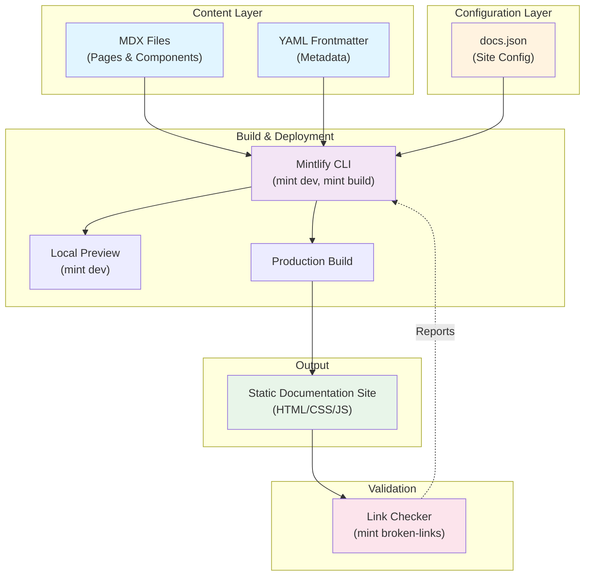
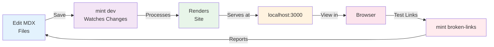

# Architecture Overview

This document provides a high-level overview of the documentation site architecture.

## System Architecture



## Development Workflow



## Technology Stack

| Component | Technology | Purpose |
|-----------|-----------|---------|
| **Content** | MDX | Markdown with JSX for dynamic content |
| **Metadata** | YAML | Frontmatter for page configuration |
| **Build Tool** | Mintlify CLI | Builds and serves documentation |
| **Language** | JavaScript/TypeScript | Development and scripting |
| **Deployment** | Static Hosting | CDN-friendly HTML output |

## File Structure

```
.
├── docs.json              # Site configuration
├── AGENTS.md              # Project instructions (this file)
├── ARCHITECTURE.md        # Architecture overview (this file)
├── pages/                 # Documentation pages (MDX)
│   ├── index.mdx
│   ├── getting-started.mdx
│   └── ...
└── public/                # Static assets
    ├── images/
    └── ...
```

## Key Development Commands

- **`mint dev`** — Start local preview server with hot reload
- **`mint build`** — Build production-ready static site
- **`mint broken-links`** — Validate all internal and external links

## Next Steps

1. Customize `docs.json` for your project settings
2. Update `AGENTS.md` with your project-specific guidelines
3. Create documentation pages in the `pages/` directory
4. Run `mint dev` to preview changes locally
5. Run `mint broken-links` before deploying to catch dead links
