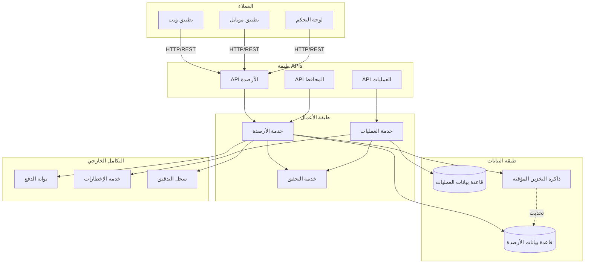

# نظام الأرصدة - الهندسة المعمارية

## نظرة عامة
رسم بياني يوضح الهندسة المعمارية الكاملة لنظام الأرصدة والمحافظ.

## مكونات النظام

### 1. طبقة العملاء (Client Layer)
- **تطبيق ويب**: واجهة المستخدم الرئيسية للويب
- **تطبيق موبايل**: تطبيق الهاتف الذكي
- **لوحة التحكم**: لوحة إدارة النظام

### 2. طبقة واجهات البرمجة (API Layer)
- **API الأرصدة**: التعامل مع عمليات الأرصدة
- **API العمليات**: إدارة العمليات المالية
- **API المحافظ**: إدارة المحافظ الرقمية

### 3. طبقة الأعمال (Business Logic Layer)
- **خدمة الأرصدة**: معالجة منطق الأرصدة
- **خدمة العمليات**: معالجة العمليات المالية
- **خدمة التحقق**: التحقق من صحة البيانات والعمليات

### 4. طبقة البيانات (Data Layer)
- **قاعدة بيانات الأرصدة**: تخزين بيانات الأرصدة
- **قاعدة بيانات العمليات**: تخزين سجل العمليات
- **ذاكرة التخزين المؤقتة**: تحسين الأداء

### 5. التكامل الخارجي (External Integration)
- **بوابة الدفع**: معالجة المدفوعات
- **خدمة الإخطارات**: إرسال التنبيهات والرسائل
- **سجل التدقيق**: تسجيل جميع العمليات

## تدفق العمليات

1. يرسل العميل طلب عبر واجهة برمجية
2. يتم التحقق من صحة الطلب في خدمة التحقق
3. تعالج خدمة الأرصدة الطلب
4. يتم تحديث قاعدة البيانات وذاكرة التخزين المؤقتة
5. يتم إرسال إخطار للعميل
6. يتم تسجيل العملية في سجل التدقيق